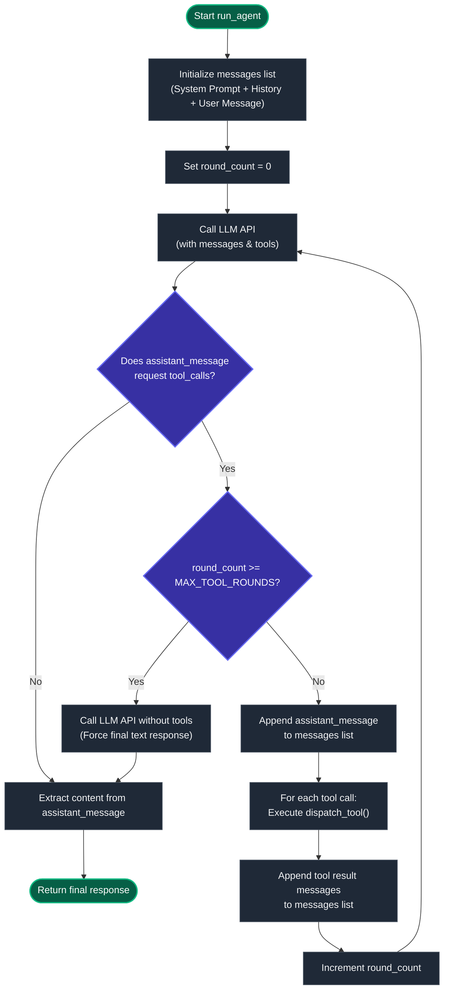

# Spec: `run_agent()`

**File:** `agent.py`
**Status:** Partially pre-filled — complete the two blank fields before implementing

---

## Purpose

Orchestrate a single conversational turn for the Plant Advisor agent. Given a user message and the conversation history, call the LLM with available tools, execute any tool calls the LLM requests, and return the final text response.

This is the core of what makes Plant Advisor an *agent* rather than a simple chatbot: the ability to decide which tools to call, use their results to inform its response, and loop until it has everything it needs.

### Agent Loop Flowchart

Here is the flow chart of the agent loop in both ASCII and Mermaid format.

#### 1. ASCII Flowchart (Text-based Drawing)
```
               ┌──────────────────────────────┐
               │       Start `run_agent()`    │
               └──────────────┬───────────────┘
                              │
                              ▼
               ┌──────────────────────────────┐
               │ Initialize messages list     │
               │ (System + History + User)    │
               └──────────────┬───────────────┘
                              │
                              ▼
               ┌──────────────────────────────┐
               │     Set `round_count = 0`    │
               └──────────────┬───────────────┘
                              │
                              ▼
        ┌──────────► ┌────────────────────────┐
        │            │      Call LLM API      │
        │            │  (with messages/tools) │
        │            └──────────┬─────────────┘
        │                       │
        │                       ▼
        │            ┌────────────────────────┐
        │            │   Are tool calls       │
        │            │   requested?           │
        │            └────┬──────────────┬────┘
        │                 │              │
        │             Yes │              │ No
        │                 ▼              ▼
        │            ┌──────────┐   ┌────────────────────────┐
        │            │  Rounds  │   │ Extract text content   │
        │            │  Limit   │   │ from assistant message │
        │            │ Reached? │   └──────────┬─────────────┘
        │            └────┬─┬───┘              │
        │              No │ │ Yes              ▼
        │                 │ │       ┌────────────────────────┐
        │                 │ └──────►│ Call LLM without tools │
        │                 ▼         │ (Force text response)  │
        │   ┌─────────────────────┐ └──────────┬─────────────┘
        │   │ Append assistant    │            │
        │   │ message to list     │◄───────────┘
        │   └─────────────┬───────┘
        │                 │
        │                 ▼
        │   ┌─────────────────────┐
        │   │ Execute tool calls  │
        │   │ (dispatch_tool)     │
        │   └─────────────┬───────┘
        │                 │
        │                 ▼
        │   ┌─────────────────────┐
        │   │ Append tool results │
        │   │ to messages list    │
        │   └─────────────┬───────┘
        │                 │
        │                 ▼
        │   ┌─────────────────────┐
        │   │ Increment           │
        │   │ `round_count`       │
        │   └─────────────┬───────┘
        │                 │
        └─────────────────┘
```

#### 2. Fixed Mermaid Diagram (Rich Display)


---

### Example Step-by-Step Message Flow

The following trace shows how the `messages` list changes round-by-round when a user asks: `"How should I care for my calathea?"`

#### 1. Initial State (Before LLM Call)
The message history is initialized with the system prompt and the user's query.
```json
[
  {
    "role": "system",
    "content": "You are a helpful Plant Care Advisor agent..."
  },
  {
    "role": "user",
    "content": "How should I care for my calathea?"
  }
]
```

#### 2. After LLM Round 1 Response
The LLM requests a tool call to look up the calathea. The assistant message requesting the tool call is appended.
```json
[
  {
    "role": "system",
    "content": "You are a helpful Plant Care Advisor agent..."
  },
  {
    "role": "user",
    "content": "How should I care for my calathea?"
  },
  {
    "role": "assistant",
    "content": null,
    "tool_calls": [
      {
        "id": "call_abc123",
        "type": "function",
        "function": {
          "name": "lookup_plant",
          "arguments": "{\"plant_name\": \"calathea\"}"
        }
      }
    ]
  }
]
```

#### 3. After Round 1 Tool Execution
The agent executes the tool and appends a `tool` role message. Note that the `tool_call_id` matches the ID from the previous assistant message.
```json
[
  {
    "role": "system",
    "content": "You are a helpful Plant Care Advisor agent..."
  },
  {
    "role": "user",
    "content": "How should I care for my calathea?"
  },
  {
    "role": "assistant",
    "content": null,
    "tool_calls": [
      {
        "id": "call_abc123",
        "type": "function",
        "function": {
          "name": "lookup_plant",
          "arguments": "{\"plant_name\": \"calathea\"}"
        }
      }
    ]
  },
  {
    "role": "tool",
    "tool_call_id": "call_abc123",
    "content": "{\"plant_name\": \"calathea\", \"light\": \"low/medium indirect light\", \"water\": \"keep moist\", \"humidity\": \"high\"}"
  }
]
```

#### 4. After LLM Round 2 Response
The LLM wants to check current seasonal conditions before finalizing. It requests a second tool call.
```json
[
  // ... (previous messages) ...
  {
    "role": "tool",
    "tool_call_id": "call_abc123",
    "content": "{\"plant_name\": \"calathea\", \"light\": \"low/medium indirect light\", \"water\": \"keep moist\", \"humidity\": \"high\"}"
  },
  {
    "role": "assistant",
    "content": null,
    "tool_calls": [
      {
        "id": "call_xyz456",
        "type": "function",
        "function": {
          "name": "get_seasonal_conditions",
          "arguments": "{}"
        }
      }
    ]
  }
]
```

#### 5. After Round 2 Tool Execution
The agent executes the seasonal lookup and appends the second tool result.
```json
[
  // ... (previous messages) ...
  {
    "role": "assistant",
    "content": null,
    "tool_calls": [
      {
        "id": "call_xyz456",
        "type": "function",
        "function": {
          "name": "get_seasonal_conditions",
          "arguments": "{}"
        }
      }
    ]
  },
  {
    "role": "tool",
    "tool_call_id": "call_xyz456",
    "content": "{\"season\": \"summer\", \"tips\": \"water more frequently, mist daily, avoid direct sun\"}"
  }
]
```

#### 6. Final Response (Loop Terminates)
The LLM now has all required information. It returns the final text response without any tool calls. The agent extracts this text and returns it to the user.
```json
[
  // ... (previous messages) ...
  {
    "role": "tool",
    "tool_call_id": "call_xyz456",
    "content": "{\"season\": \"summer\", \"tips\": \"water more frequently, mist daily, avoid direct sun\"}"
  },
  {
    "role": "assistant",
    "content": "Calatheas prefer low to medium indirect light and need to have their soil kept consistently moist. Since it is currently summer, you should mist your calathea daily to keep humidity high and water it more frequently, being careful to shield it from direct sunlight."
  }
]
```

---

## Input / Output Contract

**Inputs:**

| Parameter | Type | Description |
|-----------|------|-------------|
| `user_message` | `str` | The user's current message |
| `history` | `list` | Gradio conversation history — list of `{"role": ..., "content": ...}` message dicts |

**Output:** `str`

The agent's final text response for this turn. Should never be empty — if something goes wrong, return a user-readable fallback message.

---

## Design Decisions

*Read `specs/system-design.md` (especially the "How the Groq Tool Calling API Works" section) before reviewing these. Complete the two blank fields before writing any code.*

---

### Messages list structure

The messages list must start with the system prompt, then replay the conversation
history, then add the new user message. The app creates its chat UI with
`type="messages"`, so Gradio history arrives as a list of API-format dicts with
`role` and `content` keys. Gradio may include extra keys (like `metadata`), so
copy only the two fields the API expects:

```python
messages = [{"role": "system", "content": SYSTEM_PROMPT}]

for msg in history:
    messages.append({"role": msg["role"], "content": msg["content"]})

messages.append({"role": "user", "content": user_message})
```

---

### Initial LLM call

Pass the model, the messages list, the tool definitions, and `tool_choice="auto"`
so the LLM can decide whether to call a tool or respond directly:

```python
response = client.chat.completions.create(
    model=LLM_MODEL,
    messages=messages,
    tools=TOOL_DEFINITIONS,
    tool_choice="auto",
)
```

---

### Detecting tool calls in the response

The response object has a `choices` list. Index 0 gives the assistant message.
Check its `tool_calls` attribute — if it's truthy, the LLM wants to call tools:

```python
assistant_message = response.choices[0].message

if not assistant_message.tool_calls:
    # No tool calls — LLM has a final answer
    ...
```

---

### Appending the assistant message

When there are tool calls, append the full assistant message object to `messages`
**before** appending any tool results. The API requires this ordering — a tool
result message must immediately follow the assistant message that requested it:

```python
messages.append(assistant_message)  # must come first
```

---

### Executing and appending tool results

For each tool call, extract the name and arguments, call `dispatch_tool()`, and
append the result as a `"tool"` role message. The `tool_call_id` links this result
back to the specific tool call that requested it.

⚠️ For a no-argument tool call (like `get_seasonal_conditions` with no season),
the model may send `arguments` as the JSON string `"null"` — `json.loads` turns
that into `None`, not `{}`. Normalize before dispatching:

```python
for tool_call in assistant_message.tool_calls:
    tool_name = tool_call.function.name
    raw_args = tool_call.function.arguments
    tool_args = json.loads(raw_args) if raw_args else {}
    if not isinstance(tool_args, dict):
        tool_args = {}
    tool_result = dispatch_tool(tool_name, tool_args)

    messages.append({
        "role": "tool",
        "tool_call_id": tool_call.id,
        "content": tool_result,
    })
```

---

### Loop termination conditions

*The loop should stop when: (a) the LLM returns a response with no tool calls, OR (b) the MAX_TOOL_ROUNDS limit is reached. Describe how you will detect each condition and what you will return in each case.*

```
- No tool calls: We check if `assistant_message.tool_calls` is `None` or empty. If so, we terminate the loop and return the text content from `assistant_message.content`.
- MAX_TOOL_ROUNDS reached: We track the number of rounds in a counter `round_count`. If `round_count >= MAX_TOOL_ROUNDS`, we stop looping. To handle this gracefully, we make one final completion request to the LLM with `tool_choice="none"` (or omitting `tools`) to force a text response based on the accumulated messages list, and then return that final text response.
```

> [!NOTE]
> **Edge Cases & Failure Modes:**
> 1. **Tool Calls Requested at Max Rounds:** When `MAX_TOOL_ROUNDS` is reached, the LLM might still want to call tools instead of answering. If we stop the loop and try to read `assistant_message.content`, it could be empty or contain unresolved tool requests. *Mitigation:* We break the loop and make one final completion API call **without** passing any tools. This forces the LLM to output a text response based on whatever context it already has.
> 2. **Malformed JSON Arguments:** The LLM generates syntactically invalid JSON for tool arguments, throwing a `json.JSONDecodeError` during `json.loads()`. *Mitigation:* Catch the parse exception and feed the error string back to the LLM (as tool output) so it can fix the formatting in the next round.
> 3. **Missing/Incorrect Arguments:** The LLM requests a tool call but omits required parameters (e.g., calling `lookup_plant` without `"plant_name"`), resulting in a `KeyError`. *Mitigation:* Use `.get()` lookups and return a clean validation error to the LLM if required arguments are missing.
> 4. **Infinite Tool Loops:** The LLM gets trapped repeatedly calling the same tool with the same arguments (e.g., if a lookup continuously fails). *Mitigation:* Capped by the `MAX_TOOL_ROUNDS` loop condition.
> 5. **Mismatched Message Ordering:** The Groq API requires strict message ordering: every assistant message requesting tool calls must be immediately followed by matching tool results. Deviating from this pattern raises an API validation exception. *Mitigation:* Ensure we append the assistant message first, followed by all tool result messages, before calling the completions API again.
> 6. **Intermediate API Call Failures:** API rate limits or network issues can cause connection failures during intermediate loop iterations. *Mitigation:* Wrap completion requests in a try-except block to gracefully return a friendly user-facing fallback response.

---

### Extracting the final text response

*Once the loop exits because there are no more tool calls, how do you extract the text content from the response object? What field holds the string you should return?*

```
The text content is located at `response.choices[0].message.content`. We can access it on the final message object: `assistant_message.content`.
```

---

## Implementation Notes

*Fill this in after implementing and testing.*

**Trace of a working agent turn (what tools were called and in what order):**

```
Query: "How should I care for my calathea?"
Round 1 tool call: lookup_plant(plant_name='calathea')
Round 2 tool call: get_seasonal_conditions(season=None)
Final response: The agent successfully looked up the calathea care data (low/medium indirect light, high humidity, moist soil) and supplemented it with current summer care notes (extra humidity, watching out for direct sun).
```

**What happens when you ask about a plant that isn't in the database?**

```
The agent clearly states that the plant is not in the database, and instead of hallucinating database-sourced metrics, it offers helpful general care guidance for its plant type (e.g., tropical or succulent) based on the user's description.
```

**One thing about the tool call API that surprised you:**

```
How strict the API is about the ordering of the assistant's tool-requesting message and the subsequent tool-result messages. If they aren't matched exactly by IDs in the correct sequence, it throws a validation error.
```
